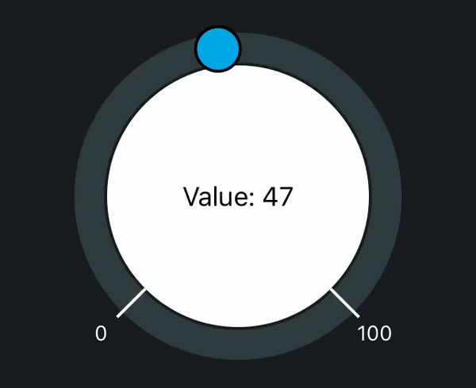

# Scroller

A scroller control for iOS:



## Example

To run the example project, clone the repo, and run `pod install` from the Example directory first.

## Installation

Scroller is available through [CocoaPods](https://cocoapods.org). To install
it, simply add the following line to your Podfile:

```ruby
pod 'Scroller', :git => 'https://github.com/tanderus/Scroller'
```

## Usage

#### Storyboard / XIB

1. Drag an UIView instance anywhere of your choice
2. Open the Identity Inspector
3. Set the custom class `Scroller` instead of `UIView`
4. Open the Connections Inspector
5. Drag value changed to the IBAction of your choice

#### Or Via Code

```swift
override func viewDidLoad() {
    super.viewDidLoad()
    let scroll = Scroller(frame: CGRect.zero)
    scroll.backgroundColor = .clear
    self.view.addSubview(scroll)
        
    scroll.translatesAutoresizingMaskIntoConstraints = false
    scroll.centerXAnchor.constraint(equalTo: self.view.centerXAnchor).isActive = true
    scroll.centerYAnchor.constraint(equalTo: self.view.centerYAnchor).isActive = true
   	scroll.widthAnchor.constraint(equalToConstant: 300).isActive = true
    scroll.heightAnchor.constraint(equalToConstant: 300).isActive = true
  
    scroll.addTarget(self, action: #selector(scrollerValueChanged), for: .valueChanged)
}
```

## IBInspectable Properties

`@IBInspectable public var circleFill: UIColor = UIColor.white`

Fill color of the inner big circle

`@IBInspectable public var circleStroke: UIColor = UIColor.white`

Stroke color for him

`@IBInspectable public var circleStrokeWidth: CGFloat = 0`

Stroke width

`@IBInspectable public var minimumValue: CGFloat = 0`

The minimum value of the scroller

`@IBInspectable public var minimumAngle: CGFloat = 45`

The angle at which the minimum value displayed (in degrees). The starting 0 angle is located at (middleX, bottomY) point.

`@IBInspectable public var minimumTickColor: UIColor = UIColor.white`

The color for minimum value tick mark

`@IBInspectable public var minimumTickWidth: CGFloat = 2`

The thickness of it

`@IBInspectable public var minimumTextColor: UIColor = UIColor.white`

The color of the value rendered as text

`@IBInspectable public var minimumFont: UIFont = UIFont.systemFont(ofSize: 14)`

The font for rendering minimum value as text


The same goes for the maximum value-related properties:

`@IBInspectable public var maximumValue: CGFloat = 100`

`@IBInspectable public var maximumAngle: CGFloat = 315`

`@IBInspectable public var maximumTickColor: UIColor = UIColor.white`

`@IBInspectable public var maximumTickWidth: CGFloat = 2`

`@IBInspectable public var maximumTextColor: UIColor = UIColor.white`

`@IBInspectable public var maximumFont: UIFont = UIFont.systemFont(ofSize: 14)`


And for the current value:

`@IBInspectable public var currentValue: CGFloat = 50`

`@IBInspectable public var currentTickColor: UIColor = UIColor(red: 0, green: 168 / 255.0, blue: 228 / 255.0, alpha: 1)`

`@IBInspectable public var currentTickWidth: CGFloat = 5`   

`@IBInspectable public var currentTextColor: UIColor = UIColor(red: 0, green: 168 / 255.0, blue: 228 / 255.0, alpha: 1)`

`@IBInspectable public var currentFont: UIFont = UIFont.systemFont(ofSize: 14)`


Properties related to the draggable ball:

`@IBInspectable public var shouldDrawBall: Bool = true`

If set to 'false', then the tick will be drawn instead and no dragging will be allowed

`@IBInspectable public var ballDiameter: CGFloat = 30`

`@IBInspectable public var ballFill: UIColor = UIColor(red: 0, green: 168 / 255.0, blue: 228 / 255.0, alpha: 1)`

`@IBInspectable public var ballStroke: UIColor = UIColor.black`

`@IBInspectable public var ballStrokeWidth: CGFloat = 2`


Ring:

`@IBInspectable public var circleToRingSpacing: CGFloat = 2`

Space between inner circle and the outer ring

`@IBInspectable public var ringColor: UIColor = UIColor(red: 122 / 255.0, green: 196 / 255.0, blue: 178 / 255.0, alpha: 0.2)`

`@IBInspectable public var ringWidth: CGFloat = 20`

## Author

tanderus, 6lackk@gmail.com

## License

Scroller is available under the MIT license. See the LICENSE file for more info.
